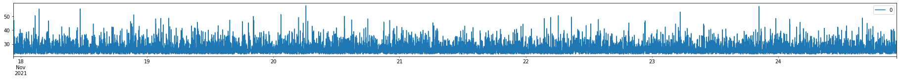
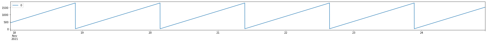
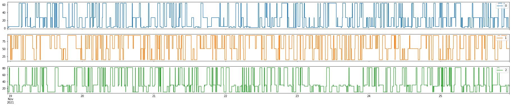

# THANOS: THis ANOmaly is Synthetic

Thanos is a Multidimensional Synthetic Data Generation library. It is written in Python and has first class support for numpy, pandas, tensorflow and language constructs. It provides reproducible on-the-fly generation of realistic timeseries.

Thanos is for 
 - Applied Research Scientists to do controlled experimentation in the time-series domain
 - ML Engineers to populate datastreams to design architectures and data systems
 - Operations Developers to load-test and benchmark system performance under data load
 - Test Engineers to validate model result quality before production deployment

To support these roles, it prioritises
 - Development ergonomics
    - flexible syntax for rapid prototyping
        - composability, fluent interface
    - embeddable in cli, notebooks, production-ready modules, and test hooks
    - Ready to go examples with realistic data profiles
 - Reliability
    - reproducible stream generation
        - stream description DSL
    - rapid sample generation with low memory overhead and no storage reqirement
 - Accessibility
    - Clear and concise implementation, easy to extend to your usecase

## Short Examples

### Constant and Random Variales

```python
a = ConstantVariable(2.0)
X = RandomVariable('gamma', seeded_gen(1), 1.0, 2.0)

for _ in range(10):
    print(a(), X())
```
```
2.0 2.1460580527450777
2.0 0.6169062882505687
2.0 10.750873745216253
2.0 0.7328542257996639
2.0 0.23072407821360733
2.0 3.5995941713115753
2.0 0.997278195708898
2.0 1.1028427536474146
2.0 0.05942688392455175
2.0 1.5281330598432985
```

### Random Seed Management

```python
b = ConstantVariable(X)

# variables as iterator generators
for _, sample in zip(range(3), b):
    print(sample)
```
```
2.08291682869501
2.08291682869501
2.08291682869501
```
```python
b.reseed(seeded_gen(123))
for _, sample in zip(range(3), b):
    print(sample)
```
```
1.1939449902453037
1.1939449902453037
1.1939449902453037
```

### Composability

```python
seed = seeded_gen(123)
Y = op(operator.add, 
       ConstantVariable(RandomVariable('uniform', seed, 0.0, 10.0)), 
       RandomVariable('gamma', seed, 1.0, 2.0))
plot_examples(Y,3)
```


### Repeatability

```python
Y.reset()
plot_examples(Y, 2)
```


### Operator Support

```python
plot_examples(Y.reset() * 2 + 10)
```



### Generation Tree Inspection

```python
print_optree(Y *2 + 10)
```

```
op add
	op mul
		op add
			ConstantVariable 6.369616873214543
				RandomVariable uniform(0.0,10.0)
			RandomVariable gamma(1.0,2.0)
		ConstantVariable 2
	ConstantVariable 10
```

### Fluent Interface (Pandas-like)

```python
Y_smooth = Y.reset().window(60, sliding=True).apply(np.mean)
plot_examples(Y_smooth, 2)
```


### Streaming with Pytorch

```python
%matplotlib inline
from thanos.SyntheticDataset import *
ds = SyntheticDataset(Y_smooth.reset(), seeded_gen(5678), numdims=6)
animate_plot(ds)
```


## Simple Signals

### Seasonality

```python
seasonal = op(operator.add,
              RandomVariable('gamma', seed, 1.0, 1.5), 
              op(operator.mul, Seasonality(), ConstantVariable(RandomVariable('uniform', seed, 0.0, 3.0))))
plot_examples(seasonal)
```


### Trend

```python
trended = op(operator.add, seasonal, Trend(rate=1/(60*24)))
plot_examples(trended)
```


### Business Hours

```python
daily_smooth = uniop(Seasonality(period = (17-9)*60, phase=today_offset()), np.abs)
business = op(mix, Conditional(DateModulation(this_week()), daily_smooth, ConstantVariable(0.0)), 
              RandomVariable('uniform', seed, 0.0, 3.0)
             )
plot_examples(business)
```


## Advanced Signal Examples

These examples are from the public service now documentation of signal classification as documented in [ITOM-Health](https://docs.servicenow.com/bundle/quebec-it-operations-management/page/product/event-management/concept/operational-intelligence-overview.html)

### Positive Clipped Noisy

```python
positive_clipped_noisy = RandomVariable('gamma', seed, 2.0, 3.0).apply(np.clip, 10, np.inf)
plot_examples(positive_clipped_noisy)
```


### Centered Noisy (bounded)

```python
plot_examples(RandomVariable('uniform', seed, 2.0, 7.0))
```


### Skewed Noisy

```python
plot_examples(RandomVariable('gamma', seed, 2.0, 3.0).apply(np.clip, 4, 18))
```


### Accumulator

```python
accumulator = Trend(rate=1, initial_value=ConstantVariable(RandomVariable('uniform', seed, 0, 2000)), maximum=ConstantVariable(RandomVariable('uniform', seed, 1500, 2000)), minimum=20)
plot_examples(accumulator)
```



### Montinomial with Gamma Distributed Delay

```python
statecount = 4
plot_examples(StateSelector(RandomVariable('gamma', seed, 1, 2)*10,
                            RandomVariable('integers', seed, 0, statecount),
                            [ConstantVariable(RandomVariable('uniform', seed, 0, 100)) for i in range(statecount) ]),
              3)
```



## Advanced Use-Cases

### Multidimensional Anomaly Injection

ITOM Health [Anomaly Types](https://docs.servicenow.com/bundle/tokyo-it-operations-management/page/product/health-log-analytics-operator/reference/hla-op-anomalous-behavior-types.html)
